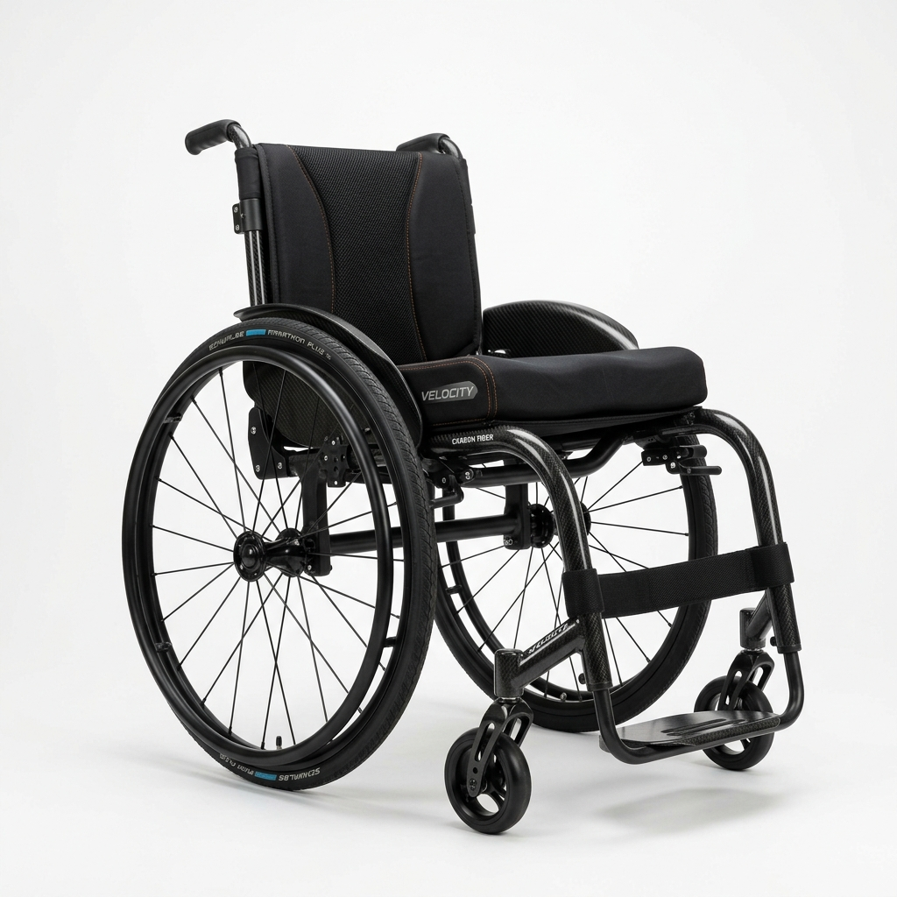

# ♿ Shadow Wheelchairs & Seating
### *Empowering Mobility, Enriching Lives*

Welcome to the official digital home of **Shadow Wheelchairs**, India's trusted partner for custom wheelchairs and advanced seating solutions. We combine clinical precision with engineering excellence to provide life-changing mobility across India.

---

## 🚀 Vision
To revolutionize the accessibility landscape in India by providing high-quality, clinically-validated mobility solutions tailored to every individual's unique postural and functional needs.

## 🌟 Key Features
- **Premium Catalog:** A curated selection of Forza Freedom wheelchairs, from ultralight manual frames to heavy-duty power chairs.
- **Next-Gen Innovation:** Specialized equipment including specialized stair climbers and smart mobility aids.
- **Clinical Excellence:** Focused on postural support, durability, and long-term user comfort.
- **Intuitive UI:** A modern, mobile-responsive, and accessible interface built for a seamless browsing experience.
- **Direct Consultation:** Integrated features for price requests and clinical advice.

## 🛠 Built With

  
  
  
  

## 📍 Contact Information
- **📞 Phone:** [+91 94456 10803](tel:+919445610803)
- **✉️ Email:** [johnson.shadowwheelchairs@outlook.com](mailto:johnson.shadowwheelchairs@outlook.com)
- **🏢 Address:** 36, Professor Sanjeevi St, Mylapore, Chennai – 600004
- **🕐 Hours:** Mon–Sat: 10:30 AM – 5:00 PM

---

Made with ❤ for patient care in India

© 2026 Shadow Wheelchairs & Seating. All Rights Reserved.

